🌸 Event Flower Exchange
The platform tackles flower waste from events like weddings and conferences, where excess fresh flowers are discarded. It connects surplus flower providers (gardeners, large flower shops, event organizers) with buyers seeking affordable flowers. The platform helps reduce waste and meet market demand for fresh flowers at lower prices.

🛠️ Technology & Tools
1. Frontend:
+ ReactJS: Build user interfaces.
+ Tailwind CSS: Design beautiful and responsive interfaces.
+ Axios: Connect to API communication.
+ Firebase Storage: Store images.
  
2. Backend:
+ ASP.NET Core Web API: Powerful backend platform.
+ SQL Server: Database management system.
+ ASP.NET Identity: User and role management.
+ JWT: Token-based security.

3. Additional features:
+ VNPay: Integrate online payment.
+ Google: Login and authenticate user information
  
🚀 Outstanding features:
🌿 User Management:
+ Secure authentication and authorization with JWT.
+ User support through intuitive interface.
🌸 Buy and sell flowers:
+ Rich product catalog, support searching and filtering.
+ Chat directly with sellers and buyers to negotiate product prices.
📦 Cart & Checkout:
+ Support cart management with quantity, value and order summary.
+ Fast payment via VN Pay and MoMo.
+ Support delivery system in Ho Chi Minh area.
⚙️ System Administration:
+ Intuitive admin interface for managing products, orders, and users.

📷 Screenshots
1. Backend API
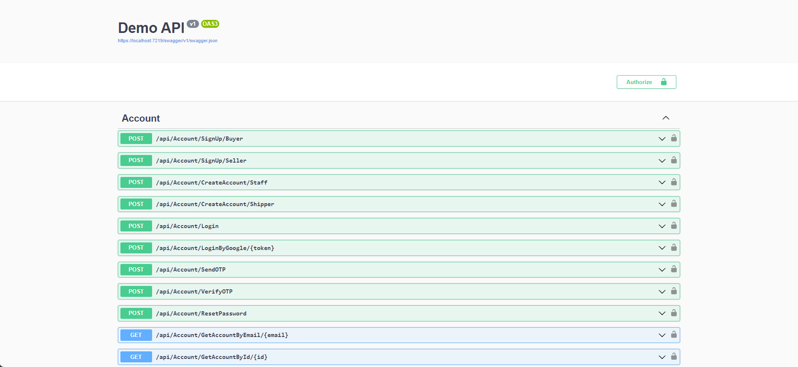
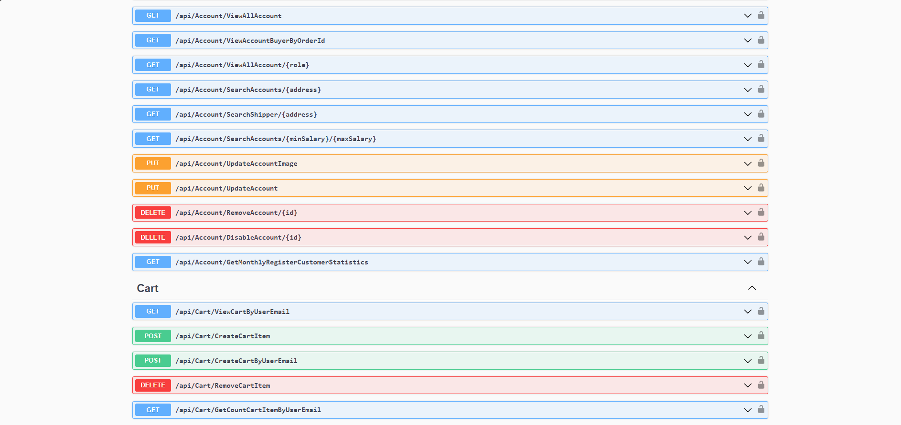
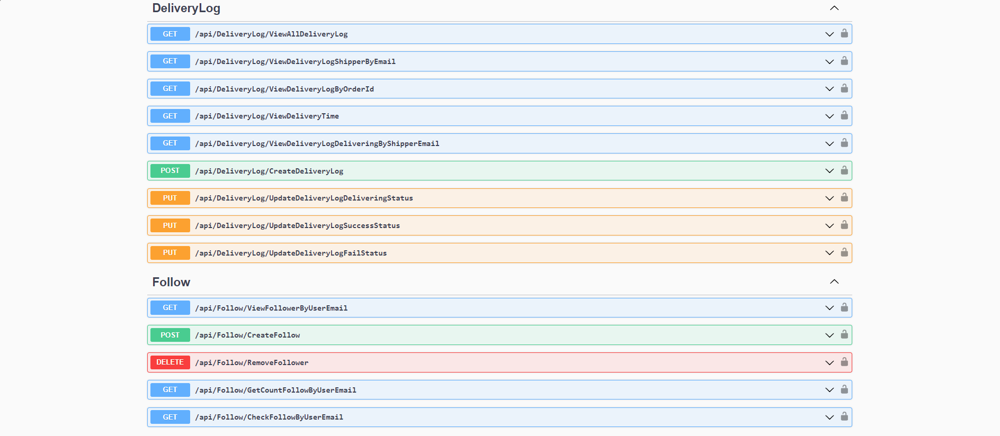
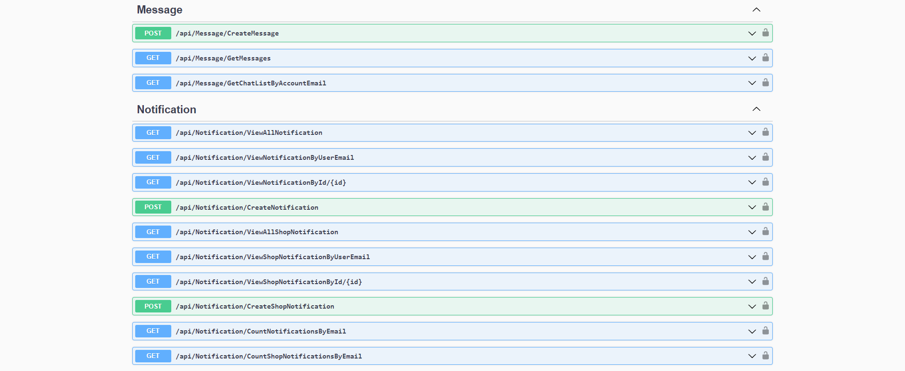
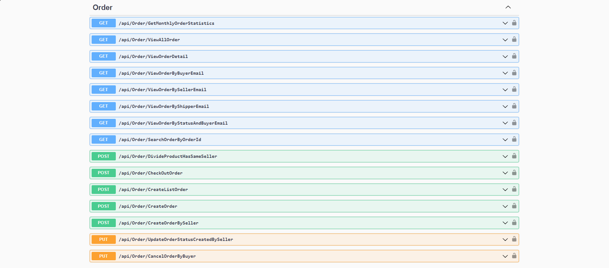
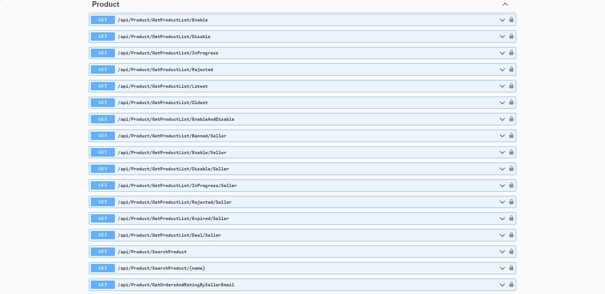
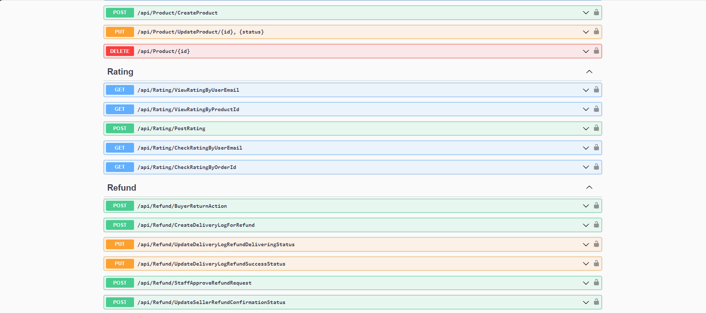
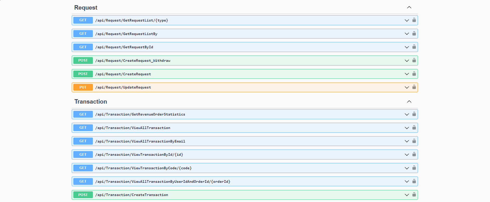
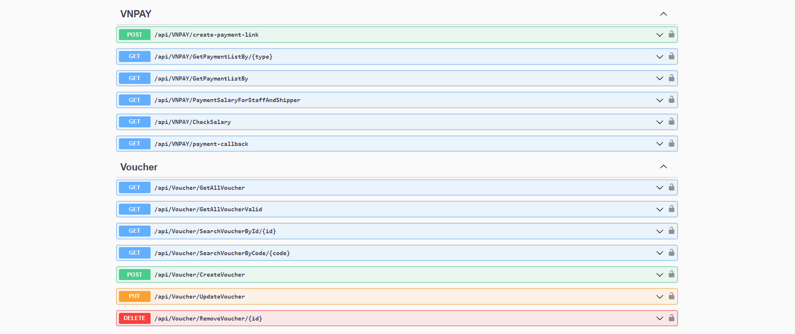
2. Home Page: 
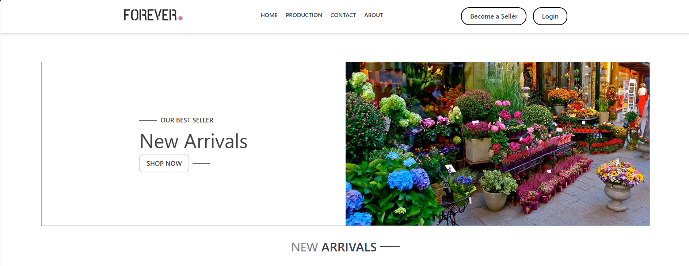
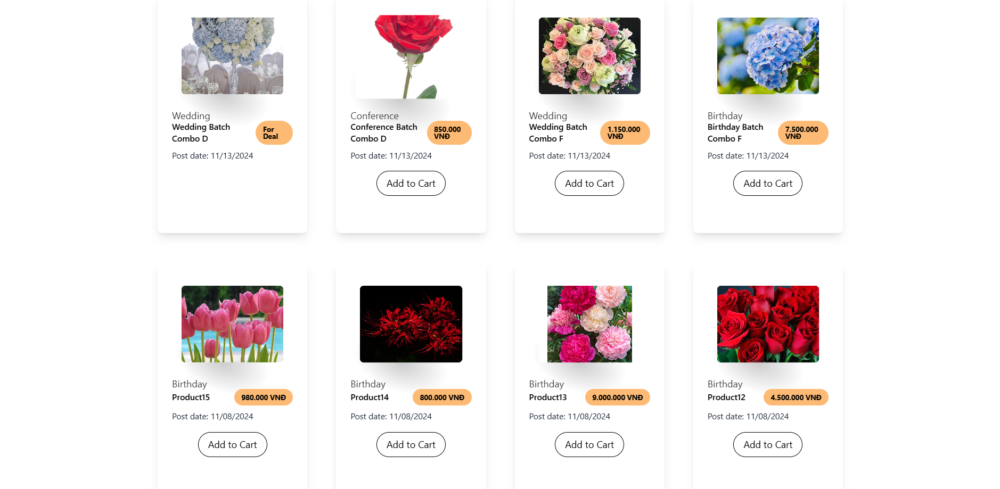
3. Chi tiết sản phẩm
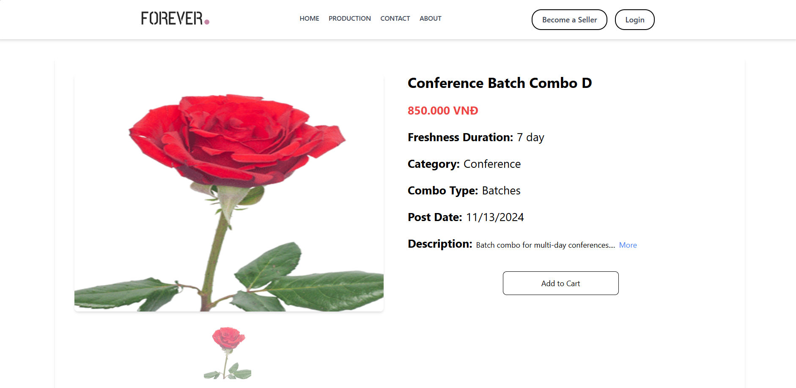
4. Giỏ hàng 
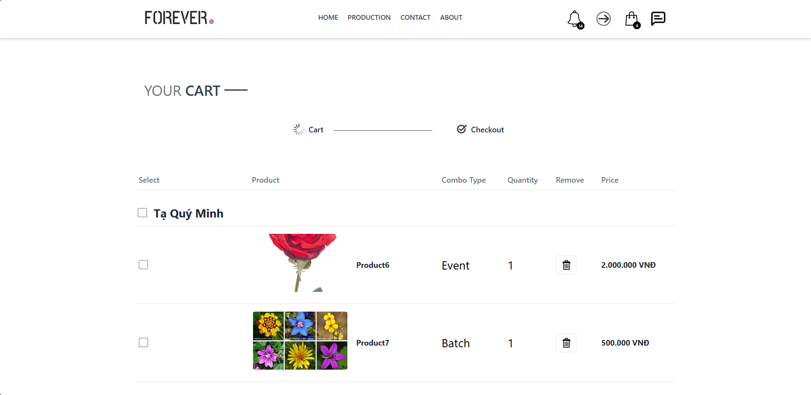

5. Checkout
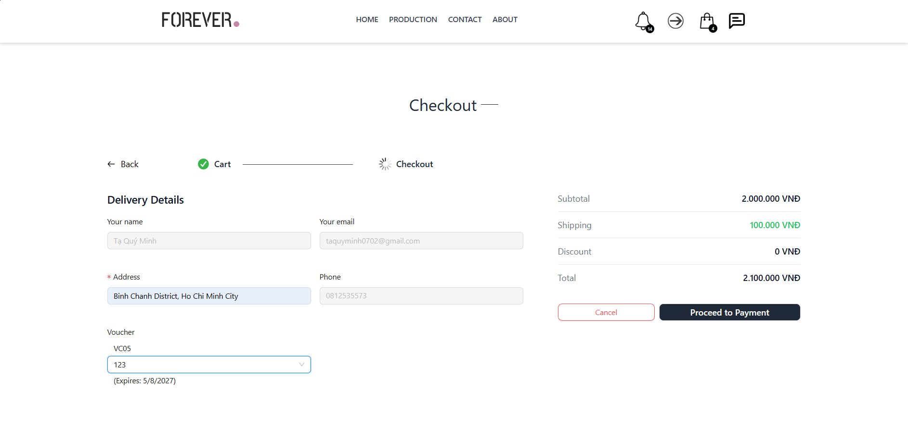
6. Chat
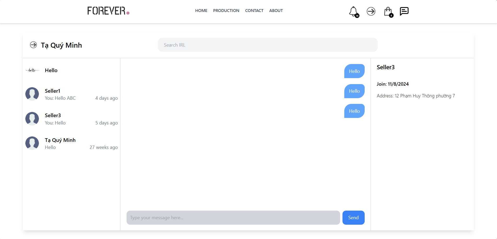
7. Trang dành cho shipper
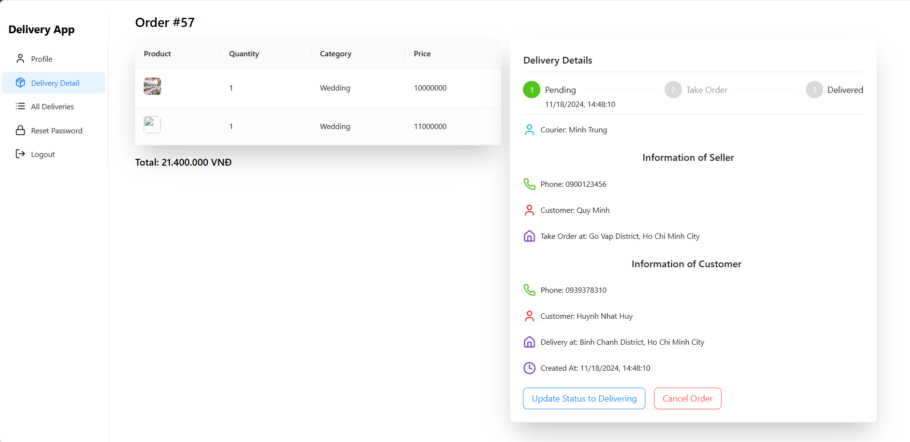
8. Tranh dành cho Manager
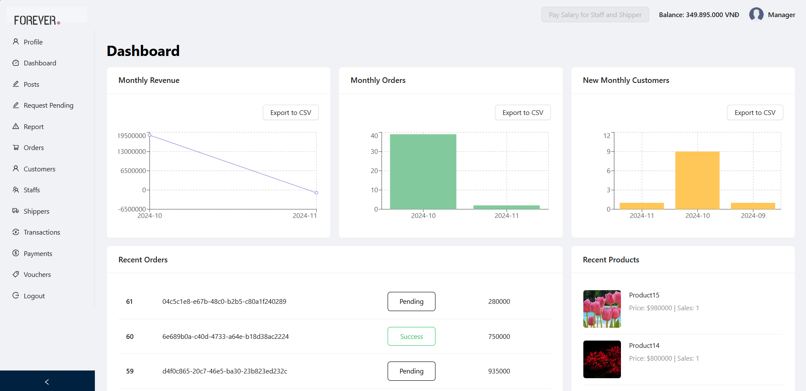

 
